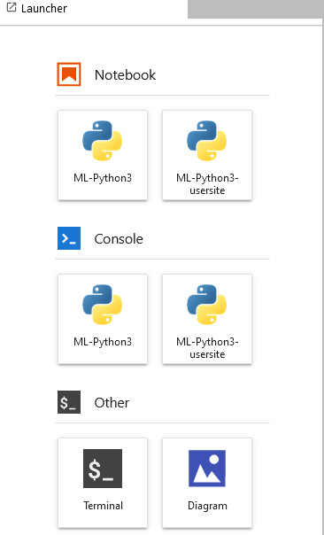

# Container Images for Machine Learning

## Introduction

Why do we create custom container images for Machine Learning?

Our objective is to construct machine learning (ML) images with the following attributes:

- Tailored to our distinct requirements for customization
- Readily accessible through CVMFS deployment
- Compatible with all three AF Jupyter servers
- Facilitate seamless extensibility by users.

## Image Types

Currently there are 4 types of ML (Machine Learning) images built:
- **ml-base**: the **base image** of the other 3 images
- **ml-pyroot**: add **PyROOT** on top of *ml-base*
- **ml-tensorflow**: add **Tensorflow** on top of *ml-base*
- **ml-tensorflow-gpu**: add **Tensorflow-gpu** on top of *ml-base*

## Package Manager `micromamba`

`conda` could resolve package dependency very well. We use the tool `micromamba` (a very fast package manger in place of `conda`) 
to install and manage packages in image building. 

[micromamba](https://mamba.readthedocs.io/en/latest/user_guide/micromamba.html) is a tiny statically linked C++ executable. 
It supports a subset of all  `conda` commands and implements a command line interface from scratch. 
And it does not come with a default version of Python.

## Image Content

A full list of packages is saved in the file *list-of-pkgs-inside.txt* under the top directory in all images. 
This file is generated during image building, and is also uploaded into the GitHub repository.

### Packages in Image *ml-base*

The packages in the image **ml-base** are:
* package manager: micromamba
* python package manager: pipenv
* python 3.8 or 3.9
- uproot
- pandas
- scikit-learn
- seaborn
- plotly_express
- jupyterlab
- lightgbm
- xgboost
- catboost
- bash
- zsh
- tcsh

Other dependency packages:
- numpy
- scipy
- akward
- matplotlib
- plotly

For the full list of packages, please refer to the file *list-of-pkgs-inside.txt*.

### Image *ml-pyroot*

The package **PyROOT** is added into the image with the command `micromamba install ROOT`.

#### Missing Library *libGL.so*

Due to [the issue with libGL.so](https://github.com/conda-forge/pygridgen-feedstock/issues/10), 
the library *libGL.so* is not automatically installed with **ROOT** and cannot be installed by `micromamba`. 
It must be installed by the system package manager `yum`.

#### RPATH in the executable files

In the executable files in the installed **PyROOT**, the parameter **RPATH** is:
```shell
% objdump -p /opt/conda/bin/root.exe | grep PATH
  RPATH                /opt/conda/lib:$ORIGIN:$ORIGIN/../lib:/home/conda/feedstock_root/build_artifacts/root_base_1689430670413/_build_env/lib
```

The hard-coded path */opt/conda/lib* could be problematic to run this image as a virtual env on a machine which has the same directory */opt/conda/lib*. 
Since the entity *$ORIGIN/../lib* could sufficiently help find the depended libraries, we had better remove the hard-coded path */opt/conda/lib*, 
which is done by replacing it by an equal-length string */0000000000000* with the command `sed`.

#### Missing *libz* in `root-config`

The *libz* is installed together with ROOT, but it is not compatible with the system *libz*. 
The command `root-config --libs` does not include *libz*, resulting in that the incompatible system *libz* 
would be used in compiling ROOT applications. To resolve this problem, *libz* is added manually in `root-config`.

## GitHub Link

The corresponding Dockerfiles and shell scripts are hosted on the following GitHub Repo:
[https://github.com/usatlas/ML-Containers](https://github.com/usatlas/ML-Containers).

- The subdir *centos7* for CentOS7-based images
- The subdir *alma9* for Alma9-based images.
 
## Docker Image Building

To build a Docker image, says, *ml-base*, just run the following command
```shell
docker build --build-arg PyVer=3.8 -t ml-base -f ml-base.Dockerfile .
```

We would tag it to "centos7-python38" for CentOS7-based image with python-3.8, or "alma9-python39" for Alma9-based image with python-3.9. For example
```shell
% docker tag ml-base yesw2000/ml-base:centos7-python38
% docker login
% docker push yesw2000/ml-base:centos7-python38
```

The above command pushes the image onto [the Docker hub](https://hub.docker.com/) under the personal account of *yesw2000*.

### CUDA-Enabled Image Building on Machines Without a GPU

If we built the image **ml-tensorflow-gpu** on a machine without a GPU, installing the package **tensorflow-gpu** would fail with error message of *python
nothing provides \__cuda needed by tensorflow*. It is [designed by purpose](https://conda-forge.org/blog/posts/2021-11-03-tensorflow-gpu/).

To enable installing the package **tensorflow-gpu** on machines without a GPU, a special env variable **CONDA_OVERRIDE_CUDA** should be defined.

## Deployment of Singularity Images onto CVMFS

The ML images are deployed onto both BNL CVMFS and CVMFS-unpacked in Singularity sandbox format.

### Images on BNL CVMFS

The images are **manually** deployed onto BNL CVMFS under */cvmfs/atlas.sdcc.bnl.gov/users/yesw/singularity/* on the machine *cvmfswrite01* at BNL, with the following command:

```shell
% singularity build --sandbox --fix-perms -F ml-base:centos7-python38 docker://yesw2000/ml-base:centos7-python38
```

### Images on CVMFS-Unpacked

All 4 ML images are deployed onto CVMFS-unpacked **automatically** via [the wishlist](https://gitlab.cern.ch/unpacked/sync/-/blob/master/recipe.yaml) 
under */cvmfs/unpacked.cern.ch/registry.hub.docker.com/yesw2000/*.

```shell
% ls /cvmfs/unpacked.cern.ch/registry.hub.docker.com/yesw2000 
ml-base:centos7-python38            ml-tensorflow-gpu:centos7-python38
ml-pyroot:centos7-python38          pyroot-atlas:centos7-python39
ml-tensorflow-cpu:centos7-python38
```

## ML Images in Jupyter

To ensure having a clean Jupyter kernel list on the running Jupyter lab/hub with the ML images, the env variable **JUPYTER_PATH** is defined to the value */opt/conda/share/jupyter*.

Because the [jupyter_client/manager.py](https://github.com/jupyter/jupyter_client/blob/main/jupyter_client/manager.py) will 
replace `python`, `python3`, or `python3.8` with the python executable to start `jupyter-lab` or `jupyter-labhub`, the default python3 kernel 
is modified as follows (for images with *python3.8*):
```json
{
 "argv": [
  "/usr/bin/env", "python3.8", "-s",
  "-m",
  "ipykernel_launcher",
  "-f",
  "{connection_file}"
 ],
 "display_name": "ML-Python3",
 "language": "python",
 "metadata": {
  "debugger": true
 }
}
```

Here the specific version of python3, that is, **python3.8**, is used, to make it work on the BNL Jupyter hub where the outside host python path 
is **prepended** into the env variable **PATH** inside running containers. So the python3 from the inside containers, 
not from the outside host, will be used.

Using the command `env`, instead of the absolute path of command `python3`, makes the images **flexible**, 
allowing the images to be used in either containers or as virtual envs.

The python option ""**-s**"" is used to ignore user site directory under *$HOME/.local/*, which may contain incompatible packages with the images.

Meanwhile, the images also add another python3 kernel **ML-Python3-usersite**, providing an option to use user site directory in Jupyter notebook.

A screenshot of the Jupter launch at BNL is enclosed below, which shows the two available options of 
**ML-Python3** and **ML-Python3-usersite** for Console and Notebook.




## Extension of ML Image Envs

Certain tools have been developed within the images to facilitate the fast extension of environments, 
enabling users to effortlessly incorporate new packages on top of the existing environment. 
These extended user environments can subsequently be conveniently reused.
### Env Extension in Container Running

Upon the container startup of the ML images, the following message would be printed out:

> % singularity run /cvmfs/unpacked.cern.ch/registry.hub.docker.com/yesw2000/ml-base:centos7-python38 
> 
> For the content in this container,
>   please read the file /list-of-pkgs-inside.txt
> 
> To create your own new env, run "**source /create-newEnv-on-base.sh** -h" for help
> Singularity>

As the message suggests, just run `source /create-newEnv-on-base.sh` to create a new extended env.
```shell
% Singularity> source /create-newEnv-on-base.sh -n myEnv -r .

                                           __
          __  ______ ___  ____ _____ ___  / /_  ____ _
         / / / / __ `__ \/ __ `/ __ `__ \/ __ \/ __ `/
        / /_/ / / / / / / /_/ / / / / / / /_/ / /_/ /
       / .___/_/ /_/ /_/\__,_/_/ /_/ /_/_.___/\__,_/
      /_/

Empty environment created at prefix: /tmp/yesw/test-contEnv/envs/myEnv
Next time, you can just run the following to activate your extended env
        source /tmp/yesw/test-contEnv/envs/myEnv/setup-UserEnv-in-container.sh
(myEnv) Singularity> 
(myEnv) Singularity> ls
envs
(myEnv) Singularity> ls envs
myEnv
(myEnv) Singularity> 
(myEnv) Singularity> ls -1 envs/myEnv
baseEnv_dir
bin
conda-meta
etc
lib
pyvenv.cfg
sbin
setup-UserEnv-in-container.sh
share
x86_64-conda-linux-gnu
```

A new extended env is created **instantly** (**<1s**) under the current directory (as the option **"-r ."** specifies), 
and the env destination subdir is *envs/myEnv* (the option **-n myEnv"** specifies). 

A shell script *setup-UserEnv-in-container.sh* is created, saving the Singularity image path and the bind-mount paths used.

To reuse this new extended in a new session, just simply run `source /tmp/yesw/test-contEnv/envs/myEnv/setup-UserEnv-in-container.sh`. 
It would start up the associated Singulary image, then activate this new extended env:

```shell
% source /tmp/yesw/test-contEnv/envs/myEnv/setup-UserEnv-in-container.sh
singularity exec --env CONTAINER_USERENV=yes -B /home/tmp/yesw/test-contEnv/envs/myEnv /cvmfs/unpacked.cern.ch/registry.hub.docker.com/yesw2000/ml-base:centos7-python38 /bin/bash --rcfile /home/tmp/yesw/test-contEnv/envs/myEnv/setup-UserEnv-in-container.sh
Activating the user env under /home/tmp/yesw/test-contEnv/envs/myEnv
Singularity> 
```

### Env Extension in Virtual Env

Since the images are built through `micromamba`, the images can also be used as virtual envs by sourcing the script *setupMe-on-host.sh*:

> % source /cvmfs/unpacked.cern.ch/registry.hub.docker.com/yesw2000/ml-base:centos7-python38/setupMe-on-host.sh 
> 
> To create your own new env, run "**source $EnvTopDir/create-newEnv-on-base.sh** -h" for help
> (base) %

Then we source the same script *create-newEnv-on-base.sh*** as in container running, to create an extended env:
```shell
(base) % source $EnvTopDir/create-newEnv-on-base.sh -n myEnv -r .

                                           __
          __  ______ ___  ____ _____ ___  / /_  ____ _
         / / / / __ `__ \/ __ `/ __ `__ \/ __ \/ __ `/
        / /_/ / / / / / / /_/ / / / / / / /_/ / /_/ /
       / .___/_/ /_/ /_/\__,_/_/ /_/ /_/_.___/\__,_/
      /_/

Empty environment created at prefix: /home/tmp/yesw/test-env/envs/myEnv
Next time, you can just run the following to activate your extended env
        source /home/tmp/yesw/test-env/envs/myEnv/setupMe-on-host.sh
(myEnv) %
(myEnv) % ls 
envs
(myEnv) % ls envs
myEnv
(myEnv) % ls -1 envs/myEnv 
baseEnv_dir
bin
conda-meta
etc
lib
pyvenv.cfg
sbin
setupMe-on-host.sh
share
x86_64-conda-linux-gnu
```

The script *setupMe-on-host.sh* is copied from the image path into the new extended env subdir *envs/myEnv*. 
And the script can be sourced to **reuse** the extended env **in a new session**:

```shell
% source /home/tmp/yesw/test-env/envs/myEnv/setupMe-on-host.sh
(base) % micromamba info

                                           __
          __  ______ ___  ____ _____ ___  / /_  ____ _
         / / / / __ `__ \/ __ `/ __ `__ \/ __ \/ __ `/
        / /_/ / / / / / / /_/ / / / / / / /_/ / /_/ /
       / .___/_/ /_/ /_/\__,_/_/ /_/ /_/_.___/\__,_/
      /_/


            environment : base (active)
           env location : /home/tmp/yesw/test-env/envs/myEnv
      user config files : /usatlas/u/yesw2000/.mambarc
 populated config files : /usatlas/u/yesw2000/.mambarc
                          /usatlas/u/yesw2000/.condarc
       libmamba version : 1.4.3
     micromamba version : 1.4.3
           curl version : libcurl/7.88.1 OpenSSL/3.1.0 zlib/1.2.13 zstd/1.5.2 libssh2/1.10.0 nghttp2/1.52.0
     libarchive version : libarchive 3.6.2 zlib/1.2.13 bz2lib/1.0.8 libzstd/1.5.2
       virtual packages : __unix=0=0
                          __linux=3.10.0=0
                          __glibc=2.17=0
                          __archspec=1=x86_64
               channels : https://conda.anaconda.org/conda-forge/linux-64
                          https://conda.anaconda.org/conda-forge/noarch
       base environment : /home/tmp/yesw/test-env/envs/myEnv
               platform : linux-64
(base) %
```

### Fast Way of Env Extension

Normally, a fresh new environment is created using _micromamba_ (or _conda_) from scratch. 
To enhance efficiency, conserve space, and save time, it's preferable to construct the new environment 
on top of an existing image environment. The following steps are implemented to facilitate this process.

All subdirs and files under *$CONDA_PREFIX*, except some special files, are **sym-linked** to the new env directory. 
So we could still reuse those packages in the image env without reinstallation.

But there are about 7K subdirs and more than 60K files in the image *ml-base*. 
There are more subdirs and files in other ML images. It would take quite a while (**a few minutes**).

To speed up the above process, we can create all the sym-links in advance, and make an archive of them. 
Then just unpack the archive in the new env creation. It could reduce the time to **10s~20s**.

Upon closer examination of the subdirectories and files, it becomes evident that a significant portion of them 
originates from the Python **site-packages** directory. Nevertheless, establishing an environmental variable 
such as **PYTHONPATH** to reference the Python site-packages within the image path is not feasible. 
This is due to the fact that entries in the **PYTHONPATH** would take precedence in the Python `sys.path`, 
consequently concealing packages with identical names in the new environment.

Thankfully, the [pyvenv.cfg](https://python.readthedocs.io/en/latest/library/site.html?highlight=pyvenv%20cfg) file, 
specifically designed for Python virtual environments, offers a solution to the above challenge:

> Singularity> cat pyvenv.cfg 
> 	home = /opt/conda/bin
> 	**include-system-site-packages** = true
> 	version = 3.8.17
> Singularity> 

In the file, the parameter *include-system-site-packages* is set to true, and the `python3` 
in the new environment directory is **sym-linked** to the `python3` from the image path.

```shell
Singularity> ls -l `which python3`
lrwxrwxrwx 1 yesw2000 usatlas 26 Aug 21 21:32 /home/tmp/yesw/test-contEnv/envs/myEnv/bin/python3 -> ../baseEnv_dir/bin/python3

Singularity> ls -l baseEnv_dir
lrwxrwxrwx 1 yesw2000 usatlas 10 Aug 22 16:21 baseEnv_dir -> /opt/conda

Singularity> python3 -s
Python 3.8.17 | packaged by conda-forge | (default, Jun 16 2023, 07:06:00) 
[GCC 11.4.0] on linux
Type "help", "copyright", "credits" or "license" for more information.
>>> import pprint
>>> pp = pprint.PrettyPrinter(indent=4)
>>> import sys
>>> pp.pprint(sys.path)
[   '',
    '/home/tmp/yesw/test-contEnv/envs/myEnv/lib',
    '/home/tmp/yesw/test-contEnv/envs/myEnv/lib/python3.8/site-packages',
    '/home/tmp/yesw/test-contEnv/envs/myEnv/baseEnv_dir/lib/python38.zip',
    '/home/tmp/yesw/test-contEnv/envs/myEnv/baseEnv_dir/lib/python3.8',
    '/home/tmp/yesw/test-contEnv/envs/myEnv/baseEnv_dir/lib/python3.8/lib-dynload',
    '/home/tmp/yesw/test-contEnv/envs/myEnv/baseEnv_dir/lib/python3.8/site-packages']
>>> 
```

Four entries are present in the _sys.path_ that are associated with the `python3` from the image path:

- *baseEnv_dir/lib/python38.zip*
- *baseEnv_dir/lib/python3.8*
- *baseEnv_dir/lib/python3.8/site-packages*
- *baseEnv_dir/lib/python3.8/site-packages*

With the help of *pyvenv.cfg* and the pre-created archive of sym-links, a new extended environment could be created in less than one second.
